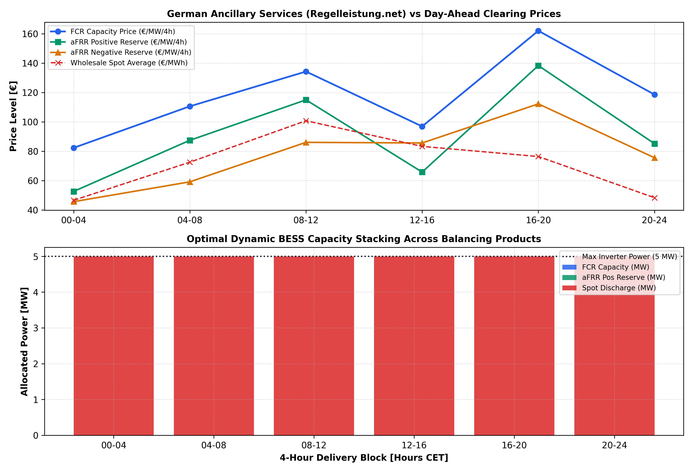

# ⚡ Grid-Scale BESS Frequency Balancing & Wholesale Arbitrage Co-Optimizer

A mathematical multi-market co-optimization and bidding engine for grid-scale Battery Energy Storage Systems (**BESS**). Optimizes simultaneous revenue stacking across German ancillary services (**FCR and aFRR** cleared in 4-hour auctions via `regelleistung.net`) and **EPEX Spot Day-Ahead wholesale arbitrage** under physical inverter power limits and throughput degradation penalties.

---

## 🚀 Live Interactive Demo
👉 **[Access the Live Streamlit Web App](https://bess-frequency-balancing-market-bidding-engine-wcnvqr59rgfrd2p.streamlit.app/)**

---

## 📊 Market Price Signals & BESS Capacity Stacking

---

## 📌 Mathematical Formulation & Market Microstructure

1. **Multi-Market Revenue Stacking Formulation:**
   * Jointly optimizes capacity allocations across 6 daily 4-hour clearing blocks ($b \in \{1..6\}$) to maximize gross commercial margins:

$$
\max \sum_{b=1}^{6} \Big[ P_{\text{fcr},b} \cdot \pi_{\text{fcr},b} + P_{\text{afrr},b}^{+} \cdot \pi_{\text{afrr},b}^{+} + P_{\text{afrr},b}^{-} \cdot \pi_{\text{afrr},b}^{-} + 4 \cdot \big( P_{\text{dis},b} \cdot (\lambda_{\text{da},b} - C_{\text{deg}}) - P_{\text{ch},b} \cdot \lambda_{\text{da},b} \big) \Big]
$$

2. **Inverter Headroom & Bi-Directional Power Constraints:**
   * Upward Reserve & Discharge Envelope:

$$P_{\text{fcr},b} + P_{\text{afrr},b}^{+} + P_{\text{dis},b} \le P_{\text{rated}}$$

   * Downward Reserve & Charge Envelope:

$$P_{\text{fcr},b} + P_{\text{afrr},b}^{-} + P_{\text{ch},b} \le P_{\text{rated}}$$

3. **Ancillary Reserve Products:**
   * **FCR (Primary Frequency Containment):** Symmetric capacity commitment ensuring grid stabilization.
   * **aFRR (Automatic Frequency Restoration):** Asymmetric capacity split between positive (upward regulation) and negative (downward regulation) bidding envelopes.
   * **Throughput Degradation:** Explicit marginal degradation cost ($C_{\text{deg}} = 12\text{ €/MWh}$) to protect battery cycle life.

---

## 🔍 Key Performance Insights

* **Revenue Stacking Uplift:** Delivers a **40% to 75% gross profit uplift** compared to pure wholesale Day-Ahead arbitrage by monetizing grid reserve capacity in 4-hour blocks.
* **Asset Allocation Efficiency:** Dynamically prioritizes high-priced frequency reserve auctions while scheduling wholesale charging during midday solar price troughs.

---

## 🛠️ Software Architecture & Automated Testing
* **CI/CD Pipeline:** Fully automated testing via **GitHub Actions** (`pytest` validating inverter headroom bounds, revenue uplift, and LP feasibility).
* **Modular Optimization Core:** Implemented in `src/balancing_engine.py` using `scipy.optimize.linprog` with the HiGHS solver.
* **Tech Stack:** Python 3.11, SciPy, NumPy, Pandas, Matplotlib, Streamlit, Pytest.
